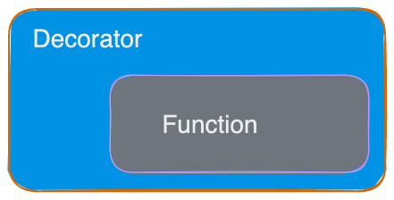

# Lesson 1 - Create a Typer App

### Typer App and Commands 

A Typer app is a command-line interface (CLI) application that you can build using 
the Typer library. Typer provides a simple and intuitive way to create command-line applications
with minimal boilerplate code. Typer apps can be used for a wide range of tasks, 
such as automating tasks, interacting with APIs, and processing data.

### Commands
In a Typer app, each command represents a separate action or task that the user 
can perform. For example, a command might be used to download a file from the internet, 
convert a file to a different format, or generate a report based on some input data. 
Commands are defined as functions that are decorated with the `@app.command()` decorator.




Decorators, _"decorate"_ the function. This is the equivalent of passing a function to another function.

```python
decorator(function())
```

**_Decorated function_**
```python
@decorator()
def function():
    return
```


### Arguments and Options

The function that's decorated as a command can take **arguments** and **options** that are
passed to the function when the command 
is invoked. 

Arguments are positional parameters that must be specified when 
the command is run, while options are named parameters that can be specified 
with a flag (e.g., --option value). 

**_argument example_**
```bash
      argument
   |------------|
cd /path/to/file
```

`cd` is the cli and `/path/to/file` is the argument

Typer provides a simple and flexible way
to define arguments and options using the `typer.Argument` and `typer.Option` classes. We'll talk
more about `Arguments` and `Options` in later lessons


### Running the Typer App

When the user runs a Typer app, they enter the name of the app followed by 
the name of the command they want to run, along with any arguments or options. 
Typer parses the input and invokes the appropriate command function, passing 
any arguments or options to the function as parameters.

**_Run_**
```bash
python main.py argument --option
```

Overall, a Typer app is a powerful and flexible way to create command-line 
interfaces for a wide range of applications. With Typer, you can define 
commands, arguments, and options with ease, and create complex CLI applications 
with minimal effort.


Open main.py for your first lesson

### Testing

cd into the lesson and run `pytest` to see if the test passes

```bash
cd Lesson-1
pytest
```

### Resources

* [Python Decorator](https://book.pythontips.com/en/latest/decorators.html)
* [Typer Command](https://typer.tiangolo.com/tutorial/commands/)
